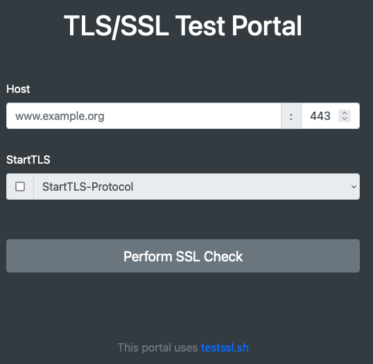
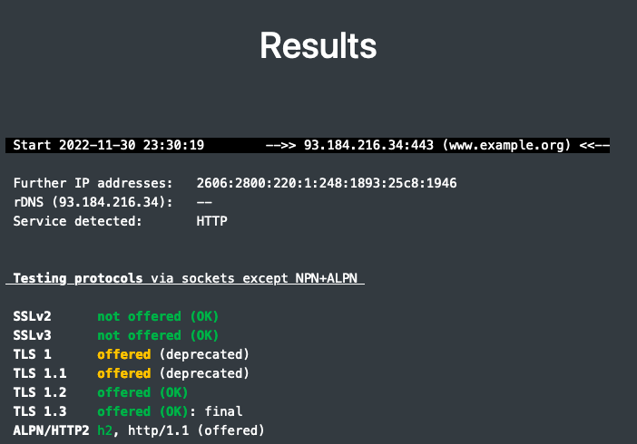

# Web Front End for testssl.sh

This project is a web interface for [testssl.sh](https://testssl.sh/). It can be used to offer internal TLS/SSL configuration check portals, whereever the usual public tools are not applicable.

## Installation

1. Clone the [testssl.sh-webfrontend](https://github.com/lugg1/testssl.sh-webfrontend) repository with its main dependency [testssl.sh](https://github.com/drwetter/testssl.sh) by invocation of `git clone --recursive https://github.com/lugg1/testssl.sh-webfrontend.git`.
2. Install Python 3 (`apt-get install python3`) and the Python module Flask by running `pip3 install flask`.
3. Install [aha](https://github.com/theZiz/aha) (`apt-get install aha`)
4. Configure SSLTestPortal.py, especially application.secret\_key, in its configuration section and create the required paths (log, result/html and result/json in the default configuration).
5. Run SSLTestPortal.py or deploy it as WSGI script.

## NGINX Reverse Proxy

If you would like to run behind a NGINX Reverse Proxy simply add this to your configuration file in sites-enabled. 
If you want to add security to it look at nginx module [basic_auth](http://nginx.org/en/docs/http/ngx_http_auth_basic_module.html).

     location /testssl/ {
          proxy_pass http://127.0.0.1:5000/;
          gzip_types text/plain application/javascript;
          proxy_http_version 1.1;
          proxy_set_header Upgrade $http_upgrade;
          proxy_set_header Connection "upgrade";
          proxy_connect_timeout 200;  # you might need to increase these values depending on your server hardware. 
          proxy_send_timeout 200;     # you might need to increase these values depending on your server hardware. 
          proxy_read_timeout 200;     # you might need to increase these values depending on your server hardware. 
          send_timeout 200;           # you might need to increase these values depending on your server hardware. 
     }

You still have to autostart the script on boot. This can be done manually in a screen.

## Docker

1. Create your container image by command `docker build --no-cache -t testssl.sh-webfrontend:latest .` on your local machine.
2. Start the container `docker run -p 8080:8080 --rm testssl.sh-webfrontend:latest`
3. Open the browser URL [http://localhost:8080](http://localhost:8080/)